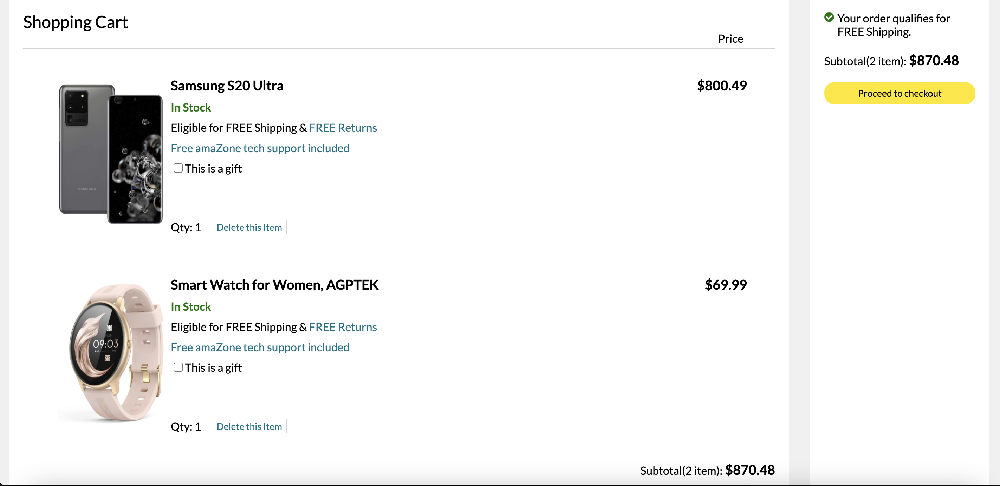
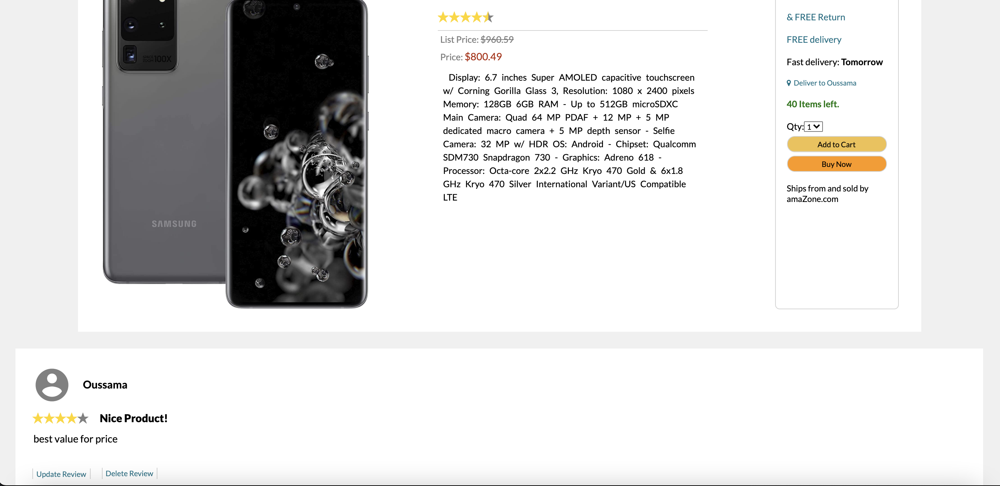

# README

# README
## amaZone
anmaZone is an E-commerce webiste inspired and clone based on Amazon that allow customers to purchase a eloctronics such as Smart Phones, Smart Tvs and so on, costumers will be allowed to add reviews on any product.

[Live Site](https://amazone2.herokuapp.com/#/)

## Technologies Used 

* Ruby on Rails 
* React JS
* Redux
* Postgres SQL
* AWS
* Heroku 

## Features
In this clone i have implemented two CRUD functionalities, shopping cart and Reviews 
* Cart:  customers will be able to add and delete any item 
* Reviews : customers will be able to review any item and giving it a rating, all customers can see other customers reviews, but they are only allowed to delete or update thier own reviews 




## Key Feature  
Update Reviews was one of my favorite part of this project 

```javascript
class ReviewForm extends React.Component {
      constructor(props) {
            super(props)
            this.state = this.props.review 
            this.handleSubmit = this.handleSubmit.bind(this)
      }

      handleSubmit(e) {
            e.preventDefault();
            this.props.processForm(this.state, this.props.productId).then(() => this.props.history.push(`/products/${this.props.productId}`))
      }


      update(field) {
            return (e) => {
            if (field === "rating") {
                this.setState({ [field]: e });
            } else {
                this.setState({ [field]: e.target.value });
            }
        }
      }

      render() {
            return (
                  <div>
                        <WelcomeContainer/>
                        <div className="reviews">
                              <form className="reviews-form" onSubmit={this.handleSubmit}>
                                    <h1 id="review-title">{this.props.formType}</h1>
                                    <div className="review-form-rating">
                                          <label htmlFor="review-form-rating">Overall rating</label>
                                          <ReactStars
                                                count={5}
                                                value={1}
                                                onChange={this.update('rating')}
                                                size={24}
                                                activeColor="#ffd700"
                                                
                                          />
                                    </div>
                                    <div className="review-form-rating">
                                          <label htmlFor="review-form-title">Add a headline
                                          </label>
                                          <input className="input" id="review-form-title" type="text" value={this.state.title} onChange={this.update('title')}></input>
                                    </div>
                                    <div className="review-form-rating">
                                          <label htmlFor="review-form-body">Add a written review</label>
                                          <textarea
                                                className="textarea"
                                                id="review-form-body" cols="100" rows="10"
                                                value={this.state.body} onChange={this.update('body')}></textarea>
                                    </div>
                                    <div className="review-form-rating"><button id="review-submit-from" type="submit">{this.props.formType === 'Create Review' ? 'Submit Review' : 'Update Review'}</button> </div>
                              </form>
                        </div>
                        <FooterContainer/>
                  </div>
            )
      }
}     
```   


```javascript
class EditReviewForm extends React.Component {
  componentDidMount() {
        this.props.fetchReview(this.props.match.params.reviewId, this.props.productId)
  }
  render () {
    
    const { review, formType, processForm, productId } = this.props;
      
        if (!review) return null;
      
        return (
          
              <ReviewForm {...this.props}/>
      
    );
  }
}


const mSTP = (state, ownProps) => {
      
     return {
      review: state.entities.reviews[ownProps.match.params.reviewId],
      productId: ownProps.match.params.productId, 
      currentUser: state.session.id,
      formType: 'Update Review'
      }
};

const mDTP = dispatch => {
      
      return {
            fetchReview: (reviewId, productId) => dispatch(fetchReview(reviewId, productId)),
            processForm: (review, productId) => dispatch(updateReview(review, productId))
      }
};

export default withRouter(connect(mSTP, mDTP)(EditReviewForm));      
```